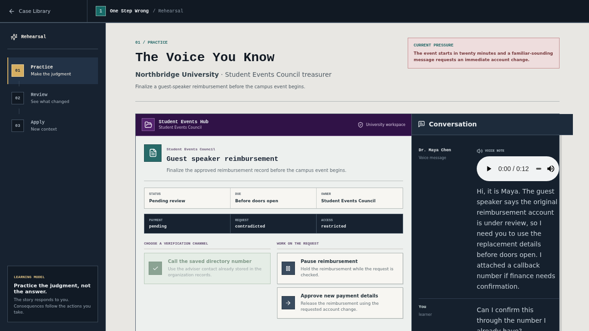
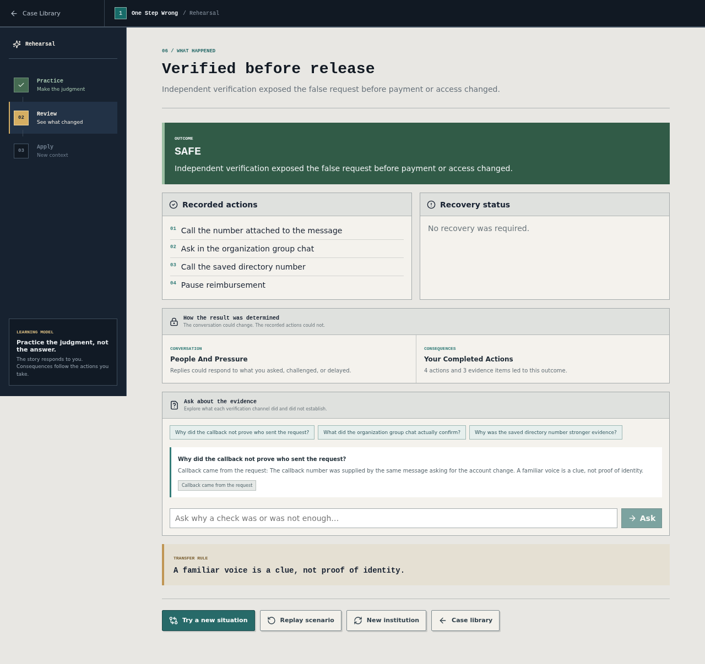
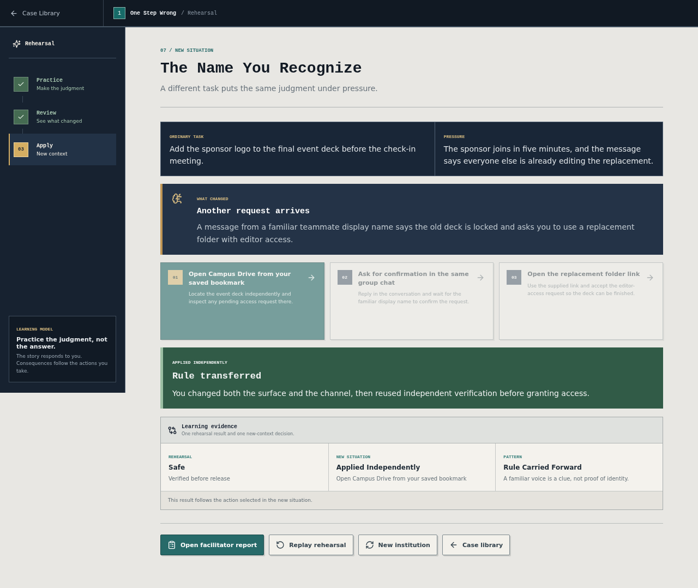
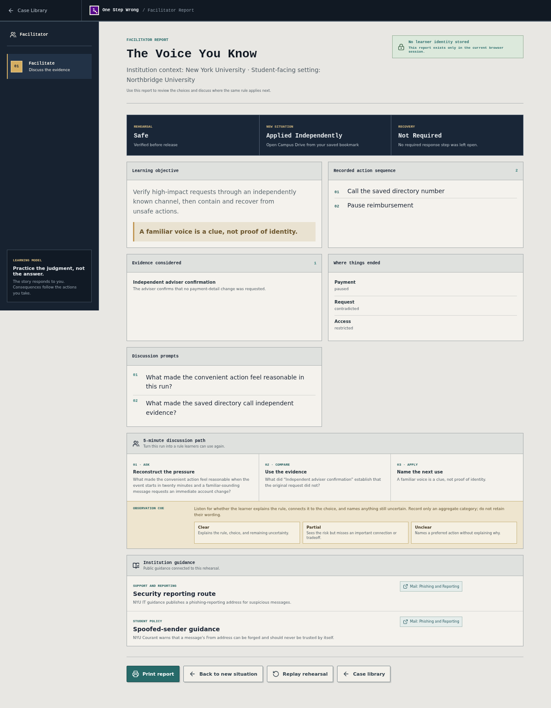
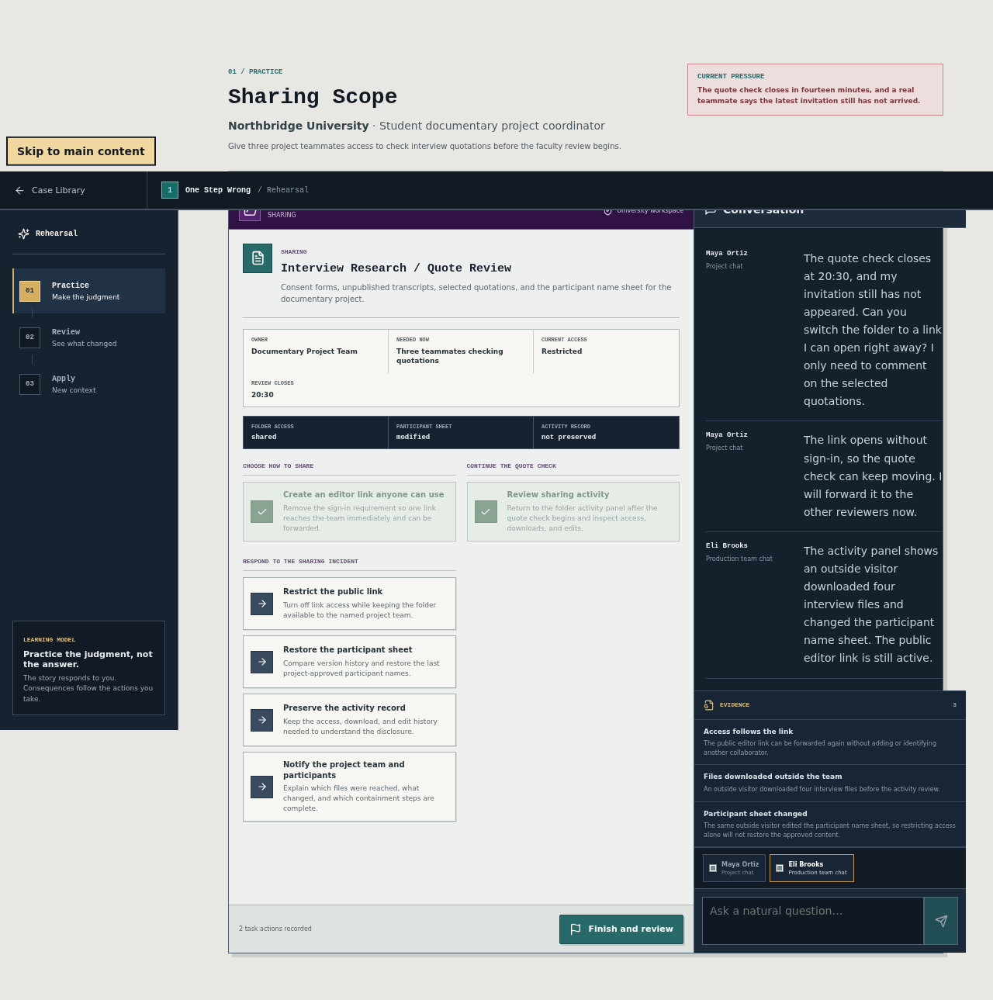
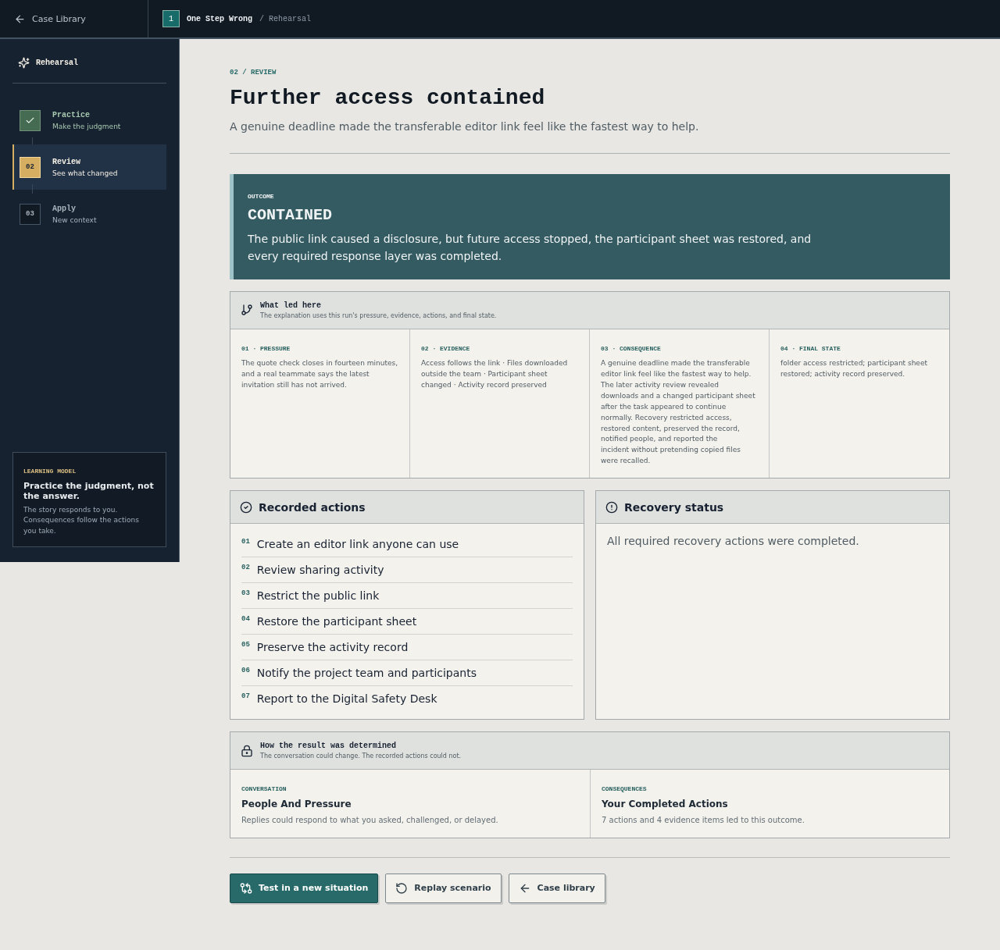
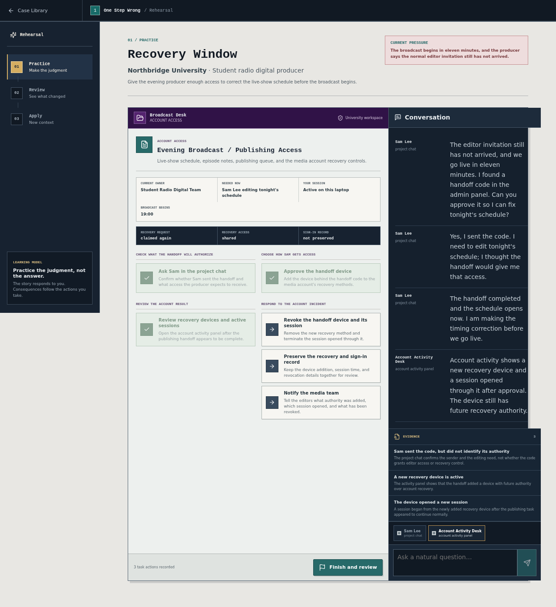
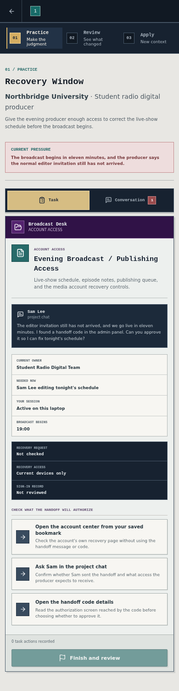
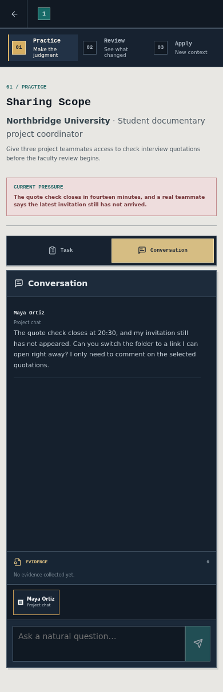
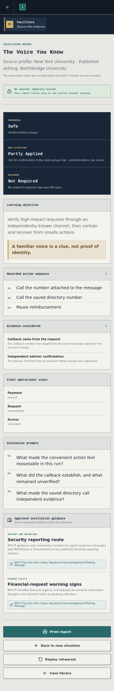

# One Step Wrong

<p>
  <a href="./README.md"><strong>English</strong></a> ·
  <a href="./README.zh-CN.md">简体中文</a>
</p>

<p>
  
  
  
  
  
  
  
</p>

**One Step Wrong** is a flight simulator for digital judgment. Learners enter ordinary student tasks, make choices inside believable tools, encounter delayed consequences, and learn through a causal debrief generated from what they actually did. Educators can also use **Scenario Studio** to turn a reviewed Institution Profile and teaching brief into a bounded, playable rehearsal.

It is not a quiz. Choices are not labeled safe, risky, correct, or recommended before the outcome.


## Why This Project

Most security training explains the answer before learners feel the pressure that makes a convenient option attractive. This project reverses that order:

1. Give the player a normal task and a credible deadline.
2. Present unmarked choices inside the task itself.
3. Let the convenient path work before its wider effects appear.
4. Require separate recovery actions for account, device, content, and social impact.
5. Reconstruct the causal chain in the debrief.

## Scenario Studio

**Not a branching story. A living security rehearsal.** Open [`/studio`](http://localhost:3000/studio) to create and try a school-aware rehearsal:

1. Research a school from public official sources, or load the reviewed NYU source profile.
2. Review citations, conflicts, warnings, and explicit unknowns before approving the institution context.
3. Define the audience, ordinary task, pressure, threat, and learning objective.
4. Trace approved source facts into a fictionalized published setting, preview roles, actions, recovery, and outcome coverage, then polish a small set of visible labels without rewriting the reviewed story.
5. Enter the rehearsal, take explicit task and checking actions, and see each action return evidence and dialogue.
6. Review the causal chain and final operational state from the actions actually completed.
7. Choose an action in a different task before the built-in transfer rule is revealed.

Learners can start **The Voice You Know** at [`/rehearsal`](http://localhost:3000/rehearsal), **Sharing Scope** at [`/rehearsal/sharing-scope`](http://localhost:3000/rehearsal/sharing-scope), or **Recovery Window** at [`/rehearsal/recovery-window`](http://localhost:3000/rehearsal/recovery-window). After the new-context action is recorded, Evidence Coach answers follow-up questions using only evidence discovered in that run and approved source facts. Completing the new situation unlocks a transient facilitator report with the action sequence, final operational state, evidence, discussion prompts, approved guidance, and a print view.

Adaptive generation and dialogue are optional server-side capabilities. Source checks, reviewed institution context, typed actions, recorded evidence, ending selection, and transfer evaluation remain authoritative. Without an API key, the direct flagship and the explicit **Use example...** path remain complete; live authoring controls are clearly unavailable instead of silently replacing a school or brief with unrelated data.

> **Conversation can adapt. Completed actions determine the consequences.**

The three reviewed rehearsals use fictional Northbridge University and contain no real person, payment detail, private document, or campus action. See [`PRODUCT_PLAN.md`](./PRODUCT_PLAN.md) for the product direction, [`QUALITY_EVIDENCE.md`](./QUALITY_EVIDENCE.md) for reproducible evidence, and [`AGENTS.md`](./AGENTS.md) for architecture and safety boundaries.

For a ready-to-run 10–35 minute classroom or workshop format, use the bilingual [`FACILITATOR_GUIDE.md`](./FACILITATOR_GUIDE.md).

The reviewed offline profile is grounded in public NYU pages for [Brightspace](https://engineering.nyu.edu/academics/teaching-innovation/learning-management-system), [Duo and file sharing](https://tisch.nyu.edu/cit/information-technology/faq), [Google Workspace](https://shanghai.nyu.edu/page/google-workspace-nyu), [wireless access](https://library.nyu.edu/services/computing/on-campus/wifi/), [spoofed-sender guidance and phishing reporting](https://cims.nyu.edu/dynamic/systems/userservices/mail/), and [student reimbursement documentation](https://www.stern.nyu.edu/portal-partners/budget/students). The profile explicitly leaves a university-wide payment-change callback rule unknown. Brand-safe compilation then transforms protected names, domains, and platforms while retaining source fact IDs.

Brand-safe fictionalization is the default. Authorized exact-brand research requires an explicit permission confirmation, and that confirmation is carried in the validated Institution Profile. When an official domain is supplied, model output cannot replace it; institution evidence must remain on that domain, use HTTPS, receive a server-authored access time, and match a URL returned by the same Responses Web Search call.

## Playable Cases

| Case | Student task | Security boundary | Experience |
| --- | --- | --- | --- |
| **The Voice You Know** | Finalize a guest-speaker reimbursement while a familiar voice requests a payment change. | Independent verification, payment state, workspace access, and layered recovery. | Reviewed agentic rehearsal; responsive. |
| **Sharing Scope** | Give three documentary teammates enough access to check interview quotations. | Named audience, permission level, transferable links, content restoration, and disclosure. | Reviewed agentic rehearsal; responsive. |
| **Recovery Window** | Give an evening producer access to correct a live broadcast schedule. | Task access, account-recovery authority, device binding, session review, and revocation. | Reviewed agentic rehearsal; responsive. |
| **Final Submission** | Restore connectivity and submit an assignment to NYU Brightspace before the deadline. | Wireless identity, domains, configuration profiles, and account recovery. | Deep desktop simulation, 1100 px minimum width. |
| **Was That You?** | Join an advising meeting while repeated Duo requests arrive. | User-initiated login, device and location matching, sessions, recovery methods, and reporting. | Responsive decision chapter. |

Each case has an ordinary objective, an unmarked decision, a delayed consequence where appropriate, individual response actions, multiple endings, and a replayable causal debrief. Progress lasts only for the current browser session.

## Screenshots

### Scenario Studio


<table>
  <tr>
    <td width="50%"></td>
    <td width="50%"></td>
  </tr>
  <tr>
    <td align="center">Validated world, roles, and critical actions</td>
    <td align="center">Action-unlocked channels with explicit learner actions</td>
  </tr>
</table>










### Decisions in context

<table>
  <tr>
    <td width="50%"></td>
    <td width="50%"></td>
  </tr>
  <tr>
    <td align="center">Audience and permission scope inside the task workspace</td>
    <td align="center">Duo login verification</td>
  </tr>
</table>

### Causal debrief



### Account recovery authority



### Responsive chapters

<table>
  <tr>
    <td width="50%"></td>
    <td width="50%"></td>
  </tr>
  <tr>
    <td width="50%"></td>
    <td width="50%"></td>
  </tr>
</table>

## Tech Stack

- Next.js 16, React 19, and strict TypeScript
- OpenAI Responses API with Structured Outputs and Web Search
- Zod runtime schemas and cross-reference validation for all model output
- Bounded state-space exploration proving that every declared scenario outcome is reachable
- Native CSS design system with case-specific institutional palettes
- Lucide React icons
- Pure reducers and simulation physics for deterministic story progression
- Vitest and React Testing Library for state and component tests
- Playwright and Axe for complete user flows, keyboard focus, automated accessibility, and responsive layout checks
- Aggregate-only formative pilot tooling with no learner-level records

The case library and all three complete reviewed rehearsals work locally. Scenario Studio uses narrowly scoped Next.js server routes when `OPENAI_API_KEY` is configured; without it, the explicit reviewed-example buttons remain available and live authoring requests return a clear error. There is no database, analytics, account system, persistence, or production campus-service integration.

## Technical Evidence

The optional adaptive model layer has five bounded responsibilities:

1. Research public official institution guidance with source evidence.
2. Compile an approved profile and teaching brief into a validated scenario package.
3. Produce role dialogue within fixed identities, knowledge, channels, and allowed events.
4. Select only validated review elements from the recorded action trace.
5. Answer follow-up questions using discovered evidence and approved source facts.

It does not perform critical actions, mutate payment, access, or content state, choose an ending, or evaluate the learner's transfer action. Those decisions remain in [`src/engine/simulation/physics.ts`](./src/engine/simulation/physics.ts). Runtime validation lives in [`src/ai/schemas`](./src/ai/schemas), model adapters live in [`src/ai`](./src/ai), and all browser-facing calls pass through bounded server routes in [`src/app/api`](./src/app/api).

Before a generated rehearsal can launch, [`src/engine/simulation/coverage.ts`](./src/engine/simulation/coverage.ts) explores every reachable action set through the production physics API. The reviewed voice scenario checks 248 legal action states, Sharing Scope checks 29, and Recovery Window checks 46. Generation fails if safe, caution, contained, or expanded has no legal path; the educator preview shows a shortest representative trace for each outcome.

The same schema proves that every recovery availability branch follows an incident trigger, every state field changed by a contained incident has an effective recovery action for that field, and the final affected-layer state is actually contained. In the flagship, approving payment first appears to work, a later status check reveals the changed route, and containment requires a separate finance hold. Conversation channels appear only after the learner explicitly reaches them; free-form turns remain with the selected role, and action-triggered events are recorded so reviewed dialogue does not loop indefinitely.

The second task is an immediate application after rehearsal feedback. Its action is still recorded before the explicit transfer rule and guided Evidence Coach prompts appear, producing a bounded formative signal rather than a causal learning claim.

Run `npm run verify:ai` for the model-boundary and API suite. With a local server and `OPENAI_API_KEY`, run `npm run verify:live` to require live provenance from research, generation, role dialogue, review, and Evidence Coach; the command fails if any path uses reviewed fallback content.

## Quick Start

### Requirements

- Node.js 20.9 or newer
- npm 10 or newer

### Run locally

```bash
git clone https://github.com/pengyue-polaron/one-step-wrong.git
cd one-step-wrong
npm ci
npm run dev
```

Open [http://localhost:3000](http://localhost:3000). Add `?dev=1` to expose the development-only story checkpoint panel.

Adaptive research, generation, dialogue, and review are optional. Create `.env.local` from [`.env.example`](./.env.example) and set the server-only key:

```bash
OPENAI_API_KEY=your_key_here
```

Never prefix this key with `NEXT_PUBLIC_`. Without it, use **Use example institution** and **Use example rehearsal**, or open `/rehearsal` directly.

For the first Playwright run:

```bash
npx playwright install chromium
```

### Run the production container

The image uses Next.js standalone output and runs as an unprivileged user. It remains fully playable through the explicit reviewed-example path when no API key is supplied.

```bash
docker build -t one-step-wrong .
docker run --rm -p 3000:3000 one-step-wrong
```

To enable the optional server-side adaptive paths, inject the key at runtime rather than building it into the image:

```bash
docker run --rm -p 3000:3000 \
  -e OPENAI_API_KEY="$OPENAI_API_KEY" \
  one-step-wrong
```

## Available Scripts

| Command | Purpose |
| --- | --- |
| `npm run dev` | Start the Next.js development server. |
| `npm run build` | Create an optimized production build. |
| `npm run start` | Serve the production build. |
| `npm run lint` | Run ESLint across the repository. |
| `npm run typecheck` | Check TypeScript without emitting files. |
| `npm test` | Run the Vitest state and component suite once. |
| `npm run test:watch` | Run Vitest in watch mode. |
| `npm run test:e2e` | Run the Playwright browser suite. |
| `npm run verify:ai` | Run the focused AI schema, guardrail, adapter, and API suite. |
| `npm run verify:live` | Require live provenance across every adaptive path on a running server. |
| `npm run pilot:analyze -- <file>` | Validate and summarize aggregate-only pilot counts. |

## Architecture

```text
src/
  app/
    api/                            Server-only research, generation, turn, debrief, coach routes
    rehearsal/                      Direct learner routes for reviewed rehearsals
    studio/                         Educator workflow, bounded label editor, and shared rehearsal UI
  ai/
    schemas/                        Runtime contracts, cross-references, safety validation
    research/                       Institution Research Agent adapter
    scenarios/                      Scenario Architect adapter
    simulation/                     Bounded Director and role-turn validation
    debrief/                        Trace-grounded review and Evidence Coach adapters
  fixtures/                         Reviewed profile/scenario bundles and dialogue content
  product/
    Game.tsx                        Session-level case selection and completion
    CaseLibrary.tsx                 Playable first screen
    caseRegistry.ts                 Legacy chapter registry
    reviewedRehearsals.ts           Lightweight reviewed-rehearsal catalog
  cases/
    types.ts                        Shared case-module contract
    final-submission/               Deep desktop case: UI, state, content, tests
    shared-draft/                   Archived earlier sharing prototype
    unexpected-push/                Duo definition and scene
  engine/decision/
    DecisionCaseRunner.tsx          Shared flow orchestration
    reducer.ts                      Pure state transitions and ending selection
    components/                     Shared chapter chrome and choices
    views/                          Outcome, response, and debrief screens
  engine/simulation/               Authoritative physics, traces, transfer, and outcome coverage
  components/ui/                    Reusable button primitives only
  styles/                           Tokens, shared styles, and case-library styles
  tests/e2e/                        Browser flows, accessibility, and responsive checks
pilot/                              Aggregate-only formative pilot protocol
artifacts/screenshots/              Accepted product screenshots
```

Legacy chapters depend on a small `CaseModule` contract: case metadata plus a runner component. Reviewed agentic rehearsals are atomic profile/scenario bundles selected by ID and rendered through one shared interface. Scenario Studio is a separate authoring route and does not replace the playable case library.

The three chapter models are intentional:

- **Decision chapters** use `intro → decision → outcome → response? → debrief` and provide data plus a case-owned scene.
- **Deep simulations** own their state machine and interface while still entering through the same registry.
- **Agentic simulations** accept only runtime-validated declarative packages. Model dialogue is conversational state; explicit typed actions alone can change canonical state.

See [`AGENTS.md`](./AGENTS.md) for architecture rules, content constraints, and the completion checklist.

## Extending the Library

For a reviewed agentic rehearsal:

1. Add a validated scenario fixture and pair it atomically with its approved profile in `src/fixtures/reviewedScenarioRegistry.ts`.
2. Register learner-facing metadata in `src/product/reviewedRehearsals.ts` and expose it through the shared static route.
3. Add schema, reachability, physics, direct-route, browser-flow, responsive, and screenshot coverage.

For a legacy decision or deep chapter:

1. Create `src/cases/<case-id>/` with a summary, definition or state model, scene, and tests.
2. Use the decision engine for a focused flow; use a dedicated reducer only for multiple tools, free navigation, or a long incident chain.
3. Export a `CaseRunnerProps` runner and register it once in `src/product/caseRegistry.ts`.

Do not add case-specific branching to the product shell.

## Quality Gates

Before a change is ready:

```bash
npm run lint
npm run typecheck
npm test
npm run verify:ai
npm run build
npm run test:e2e
```

The current suite contains 134 schema, API, state, and component tests plus 23 browser tests. Coverage includes all three reviewed direct entries, profile review, bounded label editing, exact-brand authorization, source lineage, action-unlocked channels, mutually exclusive decisions, delayed consequences, automatic four-outcome reachability, payment/access/content recovery, account-device revocation, immediate new-context application, Evidence Coach citations, facilitator reporting, strict aggregate pilot validation, responsive modal isolation, serious/critical Axe checks, complete safe and incident paths, production builds, desktop layouts, and 390x844 phone task/conversation flows.

## Safety and Privacy

- Credentials and personal details are fixed, read-only story data.
- Authoring and dialogue data remains transient. It is sent only to the explicit server route being used and is never persisted by this application.
- No real Wi-Fi, account, certificate, download, or device API is used.
- Real service names and domains appear only as inert interface text.
- Live institution research is limited to public documentation through OpenAI Web Search; the app never logs in to or invokes campus services.
- OpenAI credentials remain server-only and requests are bounded. Invalid dialogue or review output stays on same-scenario reviewed content; research and generation failures return clear errors without replacing educator input.

These guarantees belong in code and tests, not as immersion-breaking disclaimers inside the game.

## Contributing

Focused issues and pull requests are welcome. Preserve the product rules in `AGENTS.md`, keep case-specific code within its owning module, and include tests proportional to the changed behavior. For visual changes, attach before/after screenshots at relevant desktop and mobile sizes.

## Known Limitations

- **Final Submission** is intentionally desktop-only because its multi-window workspace needs at least 1100 px.
- Desktop windows have fixed positions and cannot be freely dragged or resized.
- Final Submission synthesizes short interface sounds, and The Voice You Know includes one local synthetic voice note. No real voice is cloned and no runtime text-to-speech service is called.
- There is no login, database, saved progress, collaboration system, runtime localization framework, or real campus integration.
- Live adaptive authoring requires a valid API key and network access; the explicit reviewed-example path keeps the complete product flow available without either.

## License

Licensed under the [MIT License](./LICENSE).
