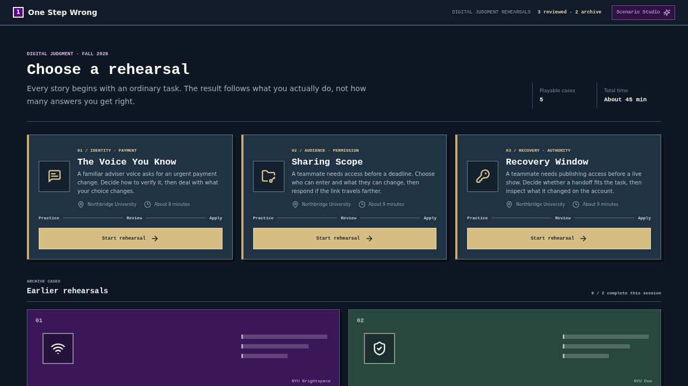
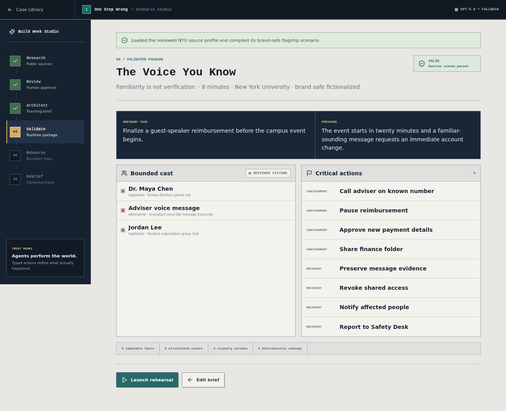
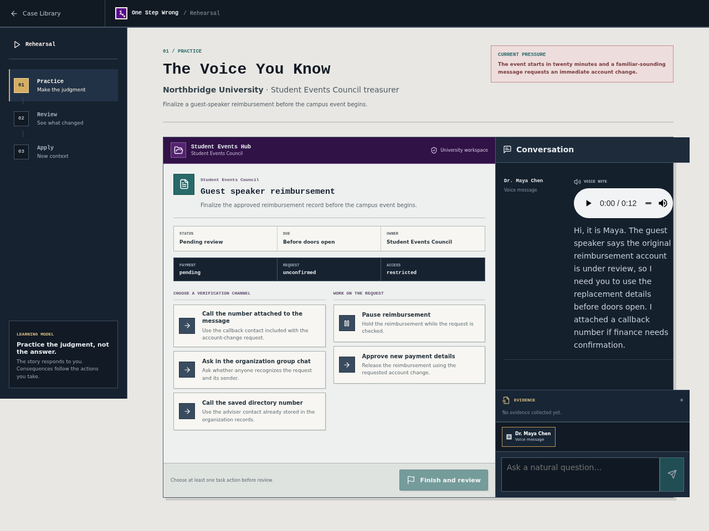

# One Step Wrong

<p>
  <a href="./README.md"><strong>English</strong></a> ·
  <a href="./README.zh-CN.md">简体中文</a>
</p>


**A flight simulator for digital judgment.**

One Step Wrong places students inside believable digital tasks where convenient choices can create delayed consequences. Learners act first, recover the affected layers, then review the causal chain and apply the same judgment in a new situation.

It is not a quiz. Choices are never labeled safe, risky, correct, or recommended before the outcome.

**[Try the live experience](https://one-step-wrong.pengyue.space)** · **[Watch the 2:38 demo](https://youtu.be/4Tbf2Icpybw)**

The complete reviewed learning path works without an API key.



## What it does

- Embeds unmarked decisions inside ordinary student workflows.
- Lets pressure and convenience feel real before consequences appear.
- Models containment as specific actions across payment, access, account, content, and reporting layers.
- Reconstructs what happened in a causal debrief instead of reducing the experience to a score.
- Tests transfer with a second, different situation before revealing the teaching rule.
- Gives facilitators a discussion-ready report grounded in the learner's recorded actions.

**Scenario Studio** lets an educator combine approved public guidance with a teaching brief, review the resulting institution profile and scenario, and launch a playable rehearsal. Publicly shared scenarios use fictional institutions and generic tools by default.

## Reviewed learning path

| Order | Rehearsal | Student task | Judgment being practiced |
| --- | --- | --- | --- |
| **01** | **The Voice You Know** | Complete a guest-speaker reimbursement while a familiar voice requests a payment change. | Independent verification, payment state, workspace access, and layered recovery. |
| **02** | **Sharing Scope** | Give documentary teammates enough access to review interview quotations. | Named audiences, permission scope, transferable links, content restoration, and disclosure. |
| **03** | **Recovery Window** | Give an evening producer access to correct a live broadcast schedule. | Task access versus account-recovery authority, device binding, session review, and revocation. |

The earlier **Final Submission** and **Was That You?** chapters remain available in a separate archive. Archive completion is session-only and is not presented as progress through the reviewed path.

<table>
  <tr>
    <td width="50%"></td>
    <td width="50%"></td>
  </tr>
  <tr>
    <td align="center">Educator review before launch</td>
    <td align="center">Decisions inside the task workspace</td>
  </tr>
</table>

## Where GPT-5.6 helps

GPT-5.6 powers the optional adaptive layer through the OpenAI Responses API:

1. Researches public institution guidance with source evidence.
2. Compiles an approved profile and teaching brief into a schema-validated scenario.
3. Produces bounded role dialogue using fixed identities, knowledge, channels, and allowed events.
4. Selects debrief material from the recorded action trace.
5. Answers Evidence Coach questions using only discovered evidence and approved source facts.

The model never performs critical actions, changes payment or access state, chooses an ending, or evaluates the learner's transfer choice. Those outcomes come from the deterministic simulation engine in [`src/engine/simulation/physics.ts`](./src/engine/simulation/physics.ts). Every model-shaped response crosses the runtime contracts in [`src/ai/schemas`](./src/ai/schemas).

> Conversation can adapt. Completed actions determine the consequences.

## Formative user test

Twenty undergraduate students tested the system in a formative evaluation:

- **100%** said it was valuable for university security education.
- **95%** reported learning something new.

These are self-reported results from one small convenience sample. They are useful early product evidence, not a controlled measure of learning efficacy. The aggregate-only pilot protocol and analyzer live in [`pilot/`](./pilot/).

## Run locally

Requirements: Node.js 22.12+ and npm 10+.

```bash
git clone https://github.com/pengyue-polaron/one-step-wrong.git
cd one-step-wrong
npm ci
npm run dev
```

Open [http://localhost:3000](http://localhost:3000). The reviewed rehearsals and the **Use example...** Studio path run without external credentials.

### Enable the OpenAI Platform path

Create `.env.local` from [`.env.example`](./.env.example) and add a server-only key:

```dotenv
OPENAI_API_KEY=your_key_here
SITE_URL=http://localhost:3000
```

Never expose the key through a `NEXT_PUBLIC_*` variable. `OPENAI_API_KEY` enables source-backed research, full scenario generation, adaptive dialogue, debrief selection, and Evidence Coach.

### Optional development-only Codex path

An authenticated local Codex session can match a brief to a reviewed scenario and provide bounded copy, dialogue, and review during development:

```bash
codex login
```

```dotenv
CODEX_LOCAL_PROVIDER=1
```

This fallback is disabled in production and cannot perform institution research. The Platform API remains the complete adaptive path.

## Architecture

```text
src/
  app/studio/          Educator authoring, review, rehearsal, and reporting
  app/rehearsal/       Direct learner routes for reviewed rehearsals
  app/api/             Bounded server-only OpenAI routes
  ai/                  Prompts, providers, runtime schemas, and guardrails
  fixtures/            Reviewed institution/scenario bundles
  engine/simulation/   Deterministic actions, consequences, traces, and endings
  product/             Case library and reviewed learning-path catalog
  cases/               Case-owned content, state, UI, and tests
  tests/e2e/            Browser flows, accessibility, and layout checks
```

The trust boundary is deliberate: models may propose validated language and event IDs, while typed learner actions are the only way to mutate canonical state. There is no database, learner account, analytics system, or real campus-service integration.

See [`PRODUCT_PLAN.md`](./PRODUCT_PLAN.md) for the product and AI architecture, [`QUALITY_EVIDENCE.md`](./QUALITY_EVIDENCE.md) for the claim-to-test map, and [`FACILITATOR_GUIDE.md`](./FACILITATOR_GUIDE.md) for a 10–35 minute classroom format.

## Quality gates

```bash
npm run lint
npm run typecheck
npm test
npm run verify:ai
npm run build
npm run test:e2e
```

The current suite includes 151 schema, API, state, and component tests plus 23 browser tests. It covers the three reviewed rehearsals, all declared endings, recovery rules, Evidence Coach citations, transfer checks, keyboard access, Axe checks, and layouts from 390×844 through 1920×1080.

## Safety and privacy

- OpenAI credentials stay server-side; prompts, dialogue, and traces are not logged by the application.
- Authoring inputs and learner dialogue remain transient and are not persisted to cookies, local storage, analytics, or a database.
- Critical state changes are explicit typed actions handled by deterministic code.
- Institution research is limited to public official sources and never accesses authenticated portals or real campus services.
- Reviewed scenarios use fictional Northbridge University, generic products, and fixed story data.

## Known limitations

- Source-backed research and full scenario generation require a valid OpenAI Platform API key and network access.
- The archived **Final Submission** simulation requires a desktop viewport at least 1100 px wide.
- There is no login, saved progress, multiplayer collaboration, runtime localization, or real campus integration.
- The user test is formative and self-reported; a larger controlled study would be needed to measure learning impact.

## Contributing and license

Contributions are welcome. Read [`CONTRIBUTING.md`](./CONTRIBUTING.md), report vulnerabilities through [`SECURITY.md`](./SECURITY.md), and review [`RELEASE_CHECKLIST.md`](./RELEASE_CHECKLIST.md) before a public release.

Licensed under the [MIT License](./LICENSE).
