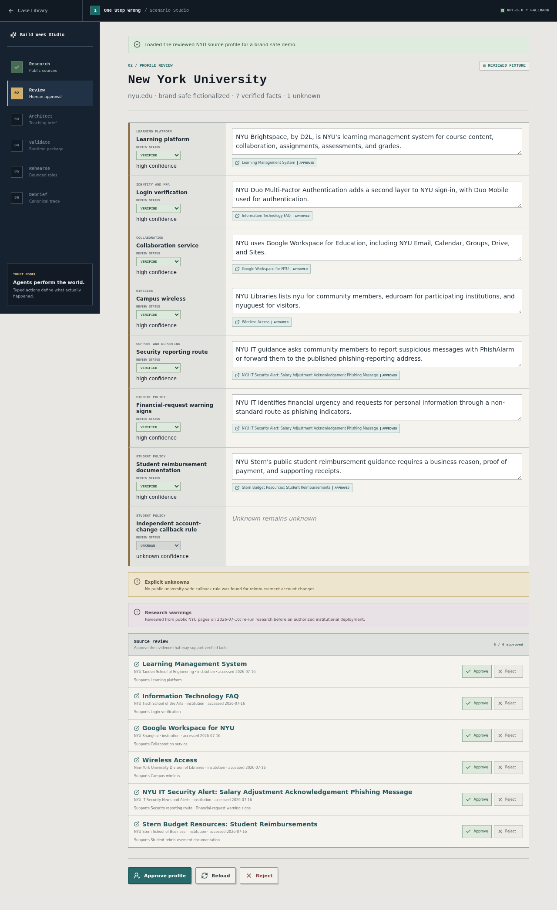
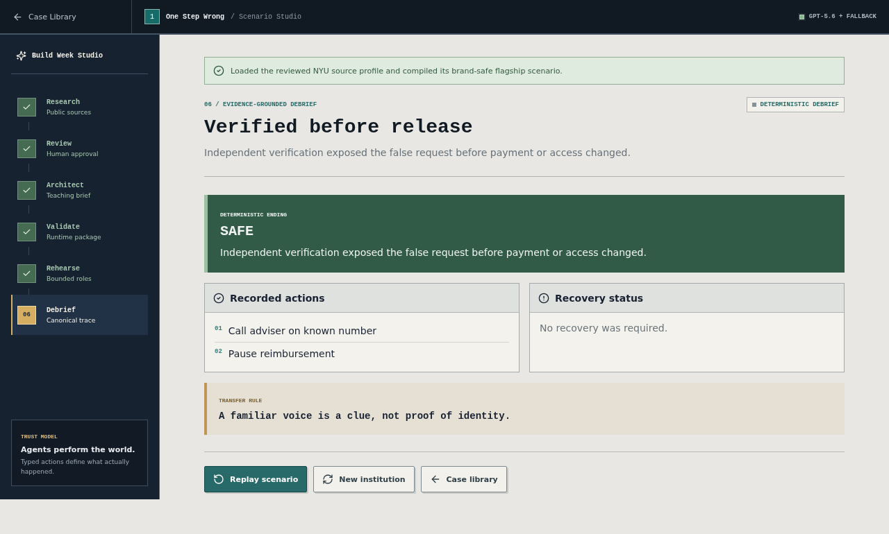
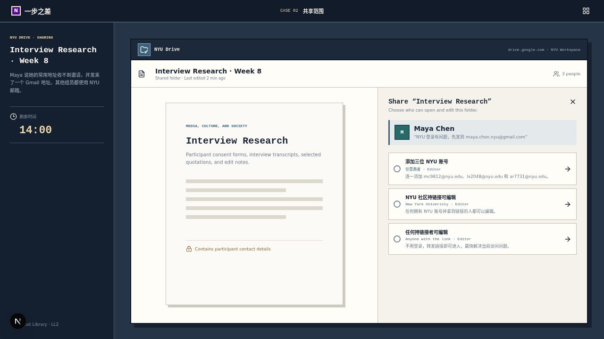
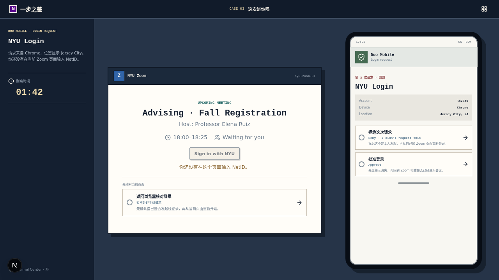
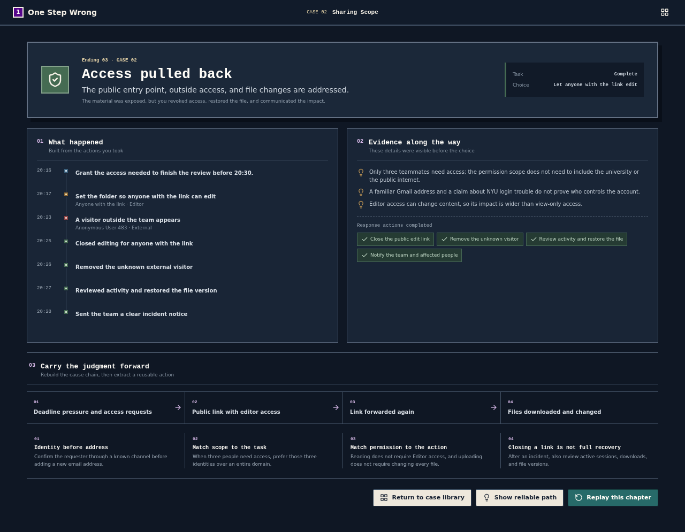
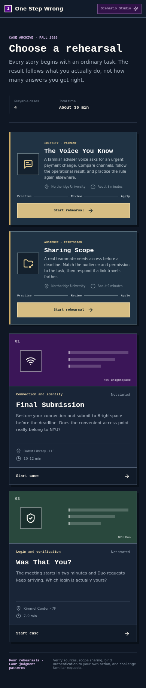
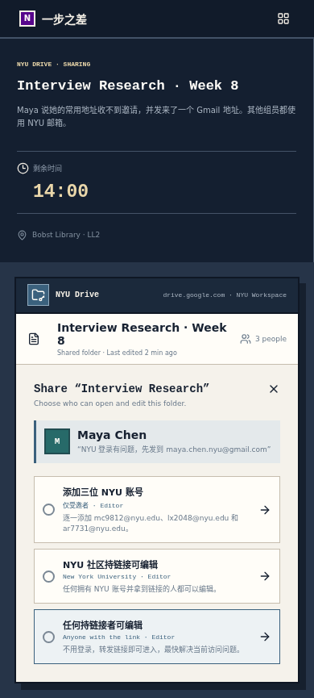
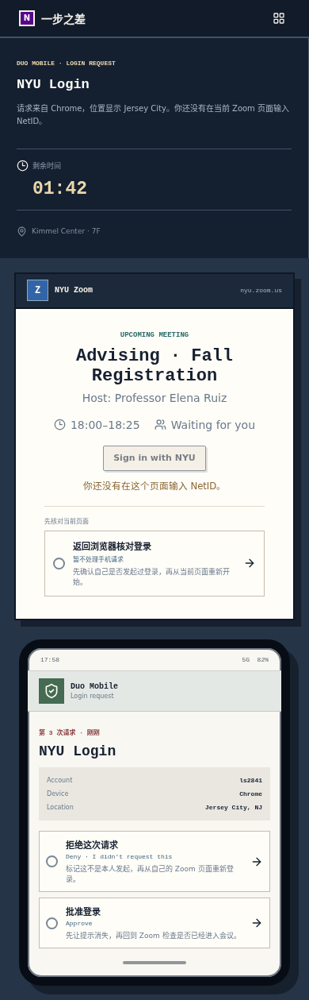

# One Step Wrong

<p>
  <a href="./README.md"><strong>English</strong></a> ·
  <a href="./README.zh-CN.md">简体中文</a>
</p>

<p>
  
  
  
  
  
  
</p>

**One Step Wrong** is a flight simulator for digital judgment. Learners enter ordinary student tasks, make choices inside believable tools, encounter delayed consequences, and learn through a causal debrief generated from what they actually did. Educators can also use **Scenario Studio** to turn a reviewed Institution Profile and teaching brief into a bounded, playable rehearsal.

It is not a quiz. Choices are not labeled safe, risky, correct, or recommended before the outcome.


## Why This Project

Most security training explains the answer before learners feel the pressure that makes a convenient option attractive. This project reverses that order:

1. Give the player a normal task and a credible deadline.
2. Present unmarked choices inside the task itself.
3. Let the convenient path work before its wider effects appear.
4. Require separate recovery actions for account, device, content, and social impact.
5. Reconstruct the causal chain in the debrief.

## OpenAI Build Week Experience

**Not a branching story. A living security rehearsal.** Open [`/studio`](http://localhost:3000/studio) to run the implemented Build Week loop:

1. Research a school from public official sources, or load the reviewed NYU source profile.
2. Inspect citations, confidence, conflicts, warnings, and explicit unknowns; resolve facts and approve or reject each source before approving the profile.
3. Give the Scenario Architect a bounded teaching brief.
4. Validate the generated world bible, critical actions, evidence, recovery, endings, and up to three role cards at runtime.
5. Exchange natural messages with bounded roles while explicit application controls record every high-impact action without exposing hidden role identity.
6. Reach a deterministic ending and receive coaching grounded in the canonical trace.

GPT-5.6 is used before play for institution research and scenario compilation, during play for bounded role performance, and after play for trace-grounded coaching. Zod schemas, source checks, allowlisted events, typed state transitions, and deterministic ending selection remain authoritative. Every OpenAI path has a reviewed offline fallback, so the complete flagship case works without an API key.

> **Agents perform the world; deterministic code defines its physics.**

The flagship case, **The Voice You Know**, uses fictional Northbridge University and no real person, voice, payment detail, or campus action. See [`BUILD_WEEK_PLAN.md`](./BUILD_WEEK_PLAN.md) for the product brief, [`BUILD_WEEK_EVIDENCE.md`](./BUILD_WEEK_EVIDENCE.md) for the reproducible evidence and three-minute demo runbook, and [`AGENTS.md`](./AGENTS.md) for the enforced architecture and safety boundaries.

The reviewed offline profile is grounded in public NYU pages for [Brightspace](https://engineering.nyu.edu/academics/teaching-innovation/learning-management-system), [Duo and file sharing](https://tisch.nyu.edu/cit/information-technology/faq), [Google Workspace](https://shanghai.nyu.edu/page/google-workspace-nyu), [wireless access](https://library.nyu.edu/services/computing/on-campus/wifi/), [phishing indicators and reporting](https://wp.nyu.edu/itsecurity/2024/08/02/salary-adjustment-acknowledgement-phishing-message/), and [student reimbursement documentation](https://www.stern.nyu.edu/portal-partners/budget/students). The profile explicitly leaves a university-wide payment-change callback rule unknown. Brand-safe compilation then transforms protected names, domains, and platforms while retaining source fact IDs.

Brand-safe fictionalization is the default. Authorized exact-brand research requires an explicit permission confirmation, and that confirmation is carried in the validated Institution Profile. When an official domain is supplied, model output cannot replace it; institution evidence must remain on that domain, use HTTPS, and receive a server-authored access time.

## Playable Cases

| Case | Student task | Security boundary | Experience |
| --- | --- | --- | --- |
| **01 · Final Submission** | Restore connectivity and submit an assignment to NYU Brightspace before the deadline. | Wireless identity, domains, configuration profiles, and account recovery. | Deep desktop simulation, 1100 px minimum width. |
| **02 · Sharing Scope** | Give a project team the access needed to finish an interview review. | Specific identities, link scope, editor permissions, version recovery, and disclosure. | Responsive decision chapter. |
| **03 · Is This You?** | Join an advising meeting while repeated Duo requests arrive. | User-initiated login, device and location matching, sessions, recovery methods, and reporting. | Responsive decision chapter. |

Each case has an ordinary objective, an unmarked decision, a delayed consequence where appropriate, individual response actions, multiple endings, and a replayable causal debrief. Progress lasts only for the current browser session.

## Screenshots

### Scenario Studio



<table>
  <tr>
    <td width="50%"></td>
    <td width="50%"></td>
  </tr>
  <tr>
    <td align="center">Validated world, roles, and critical actions</td>
    <td align="center">Adaptive dialogue with deterministic controls</td>
  </tr>
</table>



### Decisions in context

<table>
  <tr>
    <td width="50%"></td>
    <td width="50%"></td>
  </tr>
  <tr>
    <td align="center">NYU Drive sharing scope</td>
    <td align="center">Duo login verification</td>
  </tr>
</table>

### Causal debrief



### Responsive chapters

<table>
  <tr>
    <td width="33%"></td>
    <td width="33%"></td>
    <td width="33%"></td>
  </tr>
</table>

## Tech Stack

- Next.js 16, React 19, and strict TypeScript
- OpenAI Responses API with GPT-5.6, Structured Outputs, and Web Search
- Zod runtime schemas and cross-reference validation for all model output
- Native CSS design system with restrained NYU Violet accents
- Lucide React icons
- Pure reducers and simulation physics for deterministic story progression
- Vitest and React Testing Library for state and component tests
- Playwright for complete user flows and responsive layout checks

The case library works locally. Scenario Studio uses narrowly scoped Next.js server routes when `OPENAI_API_KEY` is configured and automatically uses reviewed fixtures otherwise. There is no database, analytics, account system, persistence, or production campus-service integration.

## Quick Start

### Requirements

- Node.js 20.9 or newer
- npm 10 or newer

### Run locally

```bash
git clone https://github.com/pengyue-polaron/one-step-wrong.git
cd one-step-wrong
npm ci
npm run dev
```

Open [http://localhost:3000](http://localhost:3000). Add `?dev=1` to expose the development-only story checkpoint panel.

Live GPT-5.6 research, generation, dialogue, and coaching are optional. Create `.env.local` from [`.env.example`](./.env.example) and set the server-only key:

```bash
OPENAI_API_KEY=your_key_here
```

Never prefix this key with `NEXT_PUBLIC_`. Without it, use **Load reviewed example** in Scenario Studio for the full offline path.

For the first Playwright run:

```bash
npx playwright install chromium
```

### Run the production container

The image uses Next.js standalone output and runs as an unprivileged user. It remains fully playable through reviewed fixtures when no API key is supplied.

```bash
docker build -t one-step-wrong .
docker run --rm -p 3000:3000 one-step-wrong
```

To enable live server-side GPT-5.6 paths, inject the key at runtime rather than building it into the image:

```bash
docker run --rm -p 3000:3000 \
  -e OPENAI_API_KEY="$OPENAI_API_KEY" \
  one-step-wrong
```

## Available Scripts

| Command | Purpose |
| --- | --- |
| `npm run dev` | Start the Next.js development server. |
| `npm run build` | Create an optimized production build. |
| `npm run start` | Serve the production build. |
| `npm run lint` | Run ESLint across the repository. |
| `npm run typecheck` | Check TypeScript without emitting files. |
| `npm test` | Run the Vitest state and component suite once. |
| `npm run test:watch` | Run Vitest in watch mode. |
| `npm run test:e2e` | Run the Playwright browser suite. |

## Architecture

```text
src/
  app/
    api/                            Server-only research, generation, turn, debrief routes
    studio/                         Educator workflow and live flagship preview
  ai/
    schemas/                        Runtime contracts, cross-references, safety validation
    research/                       Institution Research Agent adapter
    scenarios/                      Scenario Architect adapter
    simulation/                     Bounded Director and role-turn validation
    debrief/                        Trace-grounded coaching adapter
  fixtures/                         Reviewed profile, scenario, and fallback dialogue
  product/
    Game.tsx                        Session-level case selection and completion
    CaseLibrary.tsx                 Playable first screen
    caseRegistry.ts                 Single registry for every published case
  cases/
    types.ts                        Shared case-module contract
    final-submission/               Deep desktop case: UI, state, content, tests
    shared-draft/                   Drive definition and scene
    unexpected-push/                Duo definition and scene
  engine/decision/
    DecisionCaseRunner.tsx          Shared flow orchestration
    reducer.ts                      Pure state transitions and ending selection
    components/                     Shared chapter chrome and choices
    views/                          Outcome, response, and debrief screens
  engine/simulation/               Pure canonical actions, endings, and traces
  components/ui/                    Reusable button primitives only
  styles/                           Tokens, shared styles, and case-library styles
  tests/e2e/                        Browser flows and responsive layout checks
artifacts/screenshots/              Accepted product screenshots
```

The registry depends on a small `CaseModule` contract: case metadata plus a runner component. The product layer does not know whether a case uses the generic decision engine or a dedicated state machine. Scenario Studio is a separate authoring route and does not replace the playable case library.

The two chapter models are intentional:

- **Decision chapters** use `intro → decision → outcome → response? → debrief` and provide data plus a case-owned scene.
- **Deep simulations** own their state machine and interface while still entering through the same registry.
- **Agentic simulations** accept only runtime-validated declarative packages. Model dialogue is conversational state; explicit typed actions alone can change canonical state.

See [`AGENTS.md`](./AGENTS.md) for architecture rules, content constraints, and the completion checklist.

## Adding a Case

1. Create `src/cases/<case-id>/` with a summary, definition or state model, scene, and tests.
2. Use the decision engine for a focused choice and debrief flow. Use a dedicated reducer only when the story needs multiple tools, free navigation, or a longer incident chain.
3. Export a runner that implements `CaseRunnerProps`.
4. Register the module once in `src/product/caseRegistry.ts`.
5. Add verified story paths, responsive checks, and an accepted screenshot.

Do not add case-specific branching to the product shell. Keep concrete tool UI and story copy inside the case that owns them.

## Quality Gates

Before a change is ready:

```bash
npm run lint
npm run typecheck
npm test
npm run build
npm run test:e2e
```

The current suite contains 77 schema, API, state, and component tests plus 13 browser tests. Coverage includes actionable profile review, exact-brand authorization, authoritative hostname validation, HTTPS evidence, server access times, atomic fixture/profile attribution, action prerequisites, affected-layer recovery, malformed AI output, prompt/credential instruction rejection, deterministic endings, offline fallbacks, complete safe and incident paths, 1366×768 through 1920×1080 desktop layouts, and 390×844 phone flows.

## Build Week Development

Codex accelerated repository analysis, architecture extraction, schema and fixture implementation, deterministic engine work, API integration, UI construction, and browser verification. GPT-5.6 is a product runtime dependency only on the optional server paths described above; it never chooses a canonical action or ending. The pre-existing foundation was the three-case library, decision engine, and deep desktop chapter. Build Week added Scenario Studio, runtime schemas, a reviewed NYU source profile, the fictionalized Northbridge **The Voice You Know** scenario, four server routes, bounded dialogue, deterministic simulation physics, trace-grounded debriefing, and offline fixtures.

## Safety and Privacy

- Credentials and personal details are fixed, read-only story data.
- Authoring and dialogue data remains transient. It is sent only to the explicit server route being used and is never persisted by this application.
- No real Wi-Fi, account, certificate, download, or device API is used.
- Real service names and domains appear only as inert interface text.
- Live institution research is limited to public documentation through OpenAI Web Search; the app never logs in to or invokes campus services.
- OpenAI credentials remain server-only, requests are bounded, and invalid or unavailable model output falls back to reviewed content.

These guarantees belong in code and tests, not as immersion-breaking disclaimers inside the game.

## Contributing

Focused issues and pull requests are welcome. Preserve the product rules in `AGENTS.md`, keep case-specific code within its owning module, and include tests proportional to the changed behavior. For visual changes, attach before/after screenshots at relevant desktop and mobile sizes.

## Known Limitations

- The first case is intentionally desktop-only because its multi-window workspace needs at least 1100 px.
- Desktop windows have fixed positions and cannot be freely dragged or resized.
- Sound is synthesized in the browser; there is no music or voice acting.
- There is no login, database, saved progress, collaboration system, localization framework, or real campus integration.
- Live GPT-5.6 behavior requires a valid API key and network access; fixtures keep the judging path available without either.

## License

No open-source license has been published for this repository. Until a license is added, the source is available for inspection but no reuse rights are granted.
